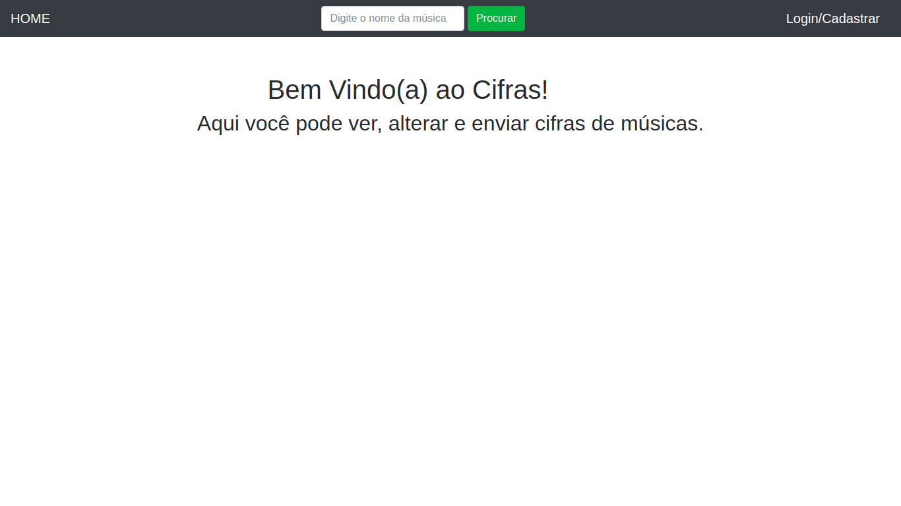

# Cifras
Aplicação feita usando o Node.js, MongoDB, Vue.js e Express para compartilhar cifras de músicas.

## Como usar

Use o npm para instalar:
```
$ npm install
```
Veja se o MongoDB esta executando.
Inicie a aplicação:
```
$ node index.js
```

## Página inicial da aplicação:

